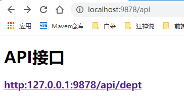
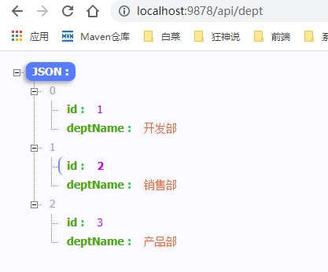
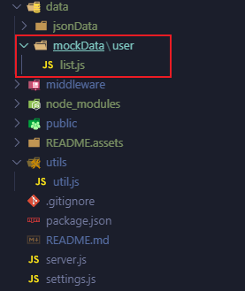
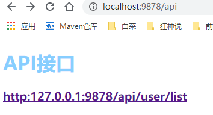
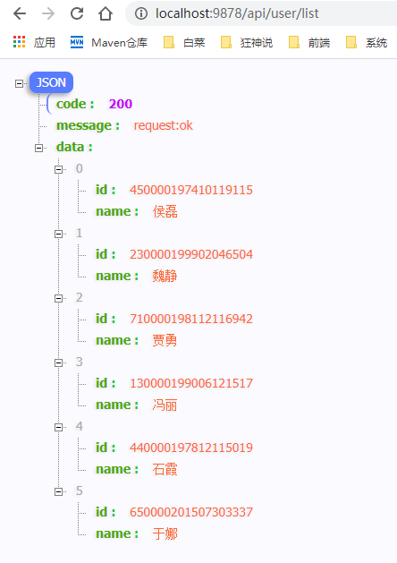

# 搭建本地local mock服务

## settings.js 配置
```json
{
    port: 9878,           // 启动端口配置
    host: '127.0.0.1',    // 主机地址
    contextPath: '/api',  // 接口根目录
    dataPath: 'data/jsonData',     //  数据存放位置
    mode: 'mock'          // mock | file 当使用file时用.json文件导出api ;mock 采用的是 mock 解析模拟数据要用.js文件导出api 
}
```

## file mode 数据配置
在dataPath(data/jsonData)下面创建数据文件 dept.json
```json
[
    {
        "id":1,
        "deptName":"开发部"
    },
    {
        "id":2,
        "deptName":"销售部"
    },
    {
        "id":3,
        "deptName":"产品部"
    }
]
```
启动服务 npm run dev 



点击api接口dept



## mock mode 数据配置

在dataPath(data/mockData)下面创建数据文件 user/list.js



```js
module.exports = {
    "data|6": [
        {
            "id":"@id",
            "name": "@cname"
        }
    ]
}
```
启动服务 npm run dev 



打开地址



